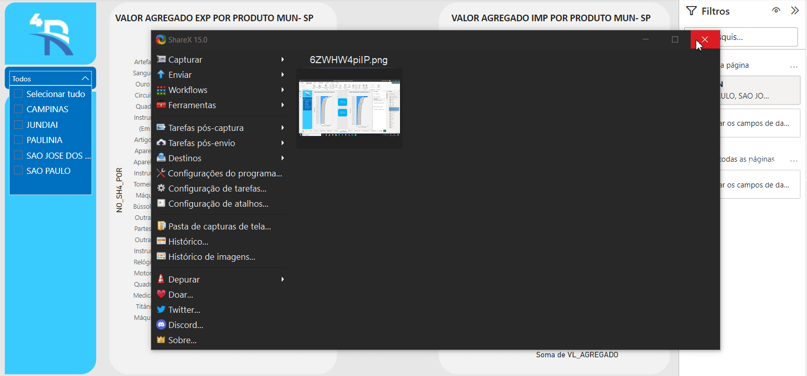

# Grupo 4 (API II) 

Nós, alunos do 2º semestre do curso de Logística da Faculdade de Tecnologia Jessen Vidal, desenvolvemos este projeto com o propósito acadêmico de complementar e aprimorar nossa capacidade analítica e logística, visando a prática da interdisciplinaridade. O Projeto é baseado na metodologia ágil SCRUM, procurando desenvolver a Proatividade, Autonomia, Colaboração e Entrega de Resultados dos estudantes envolvidos.

# Índice

* [Projeto](#Projeto)
* [Equipe](#equipe)
* [Objetivo do Projeto](#objetivo-do-projeto)
* [Funcionalidades e registros (vídeos e apresnetações) das sprints](#uncionalidades-e-registros-(vídeos-e-apresnetações)-das-sprints)
* [Backlog do produto](#Backlog-do-produto)
* [Burndown](#Burndown)
* [Autores](#autores)

# Projeto
O projeto compreende em atender a demanda do cliente entregando o MVP (Minimum viable product) ao final de cada sprint, sendo ao todo quatro sprints, com a ultima sendo a entrega do produto final.
O produto final consiste de um dashboard que identifique os modais utilizados no trnansporte internacional de cargas e a visualização das rotas utilizadas no fluxo de cargas de importação e exportação.
 
Sprint | Previsão | Status| Histórico|
|------|--------|------|--------|
|Kick Off | 04/09/2023 | Concluído| [Ver Relatório](https://fatecspgov.sharepoint.com/:p:/r/sites/Section_PLG002.A994.N.074.146.20232/Material%20de%20Aula/Kick-off%20API%202N.pptx?d=w5ac37fd2cf0d4a77b3837f72f2f03dd4&csf=1&web=1&e=f4wPfU) | 
|00| 25/09/2023  |Concluído| [Ver Relatório](https://fatecspgov.sharepoint.com/:w:/r/sites/API-G4/_layouts/15/Doc.aspx?sourcedoc=%7B69BDB881-B746-42DC-BDBD-D5BF410FCC27%7D&file=relatorio%200.docx&action=default&mobileredirect=true) | 
|01|  16/10/2023 | Concluído |[Ver Relatório](https://teams.microsoft.com/_#/pdf/viewer/teamsSdk/https:~2F~2Ffatecspgov.sharepoint.com~2Fsites~2FAPI-G4~2FShared%20Documents~2FGeneral~2FRelatorio%201%20.pdf?threadId=19:dmrDIGmxHgb4_AjL_d0NuzrJW9V_IrUPQp6pdmAFF201@thread.tacv2&subEntityId=%257B%2522viewParams%2522%253A%2522id%253D%25252Fsites%25252FAPI%25252DG4%25252FShared%252520Documents%25252FGeneral%2526listurl%253D%25252Fsites%25252FAPI%25252DG4%25252FShared%252520Documents%2526viewid%253D8c9ff52d%25252D24cd%25252D4431%25252Da5a7%25252Def663efaa32f%2522%257D&baseUrl=https:~2F~2Ffatecspgov.sharepoint.com~2Fsites~2FAPI-G4&fileId=ddc63569-ffd6-4652-b4fb-1483c7a0cb83&ctx=openFilePreview&viewerAction=view) | 
|02| 06/11/2023  | Concluído |[Ver Relatório](https://github.com/Matheus-Belonia/ProjetoAPI2/blob/main/Relat%C3%B3rio%20-%20Sprint%202.docx) | 
|03| 27/11/2023  |a fazer |[Ver Relatório]()  | 
|Feira de Soluções|12/12/2023 |a fazer |[Ver Relatório]() | 

# Equipe

# Autores
|    Função     | Nome                                  |                                                                                                                                                      LinkedIn & GitHub                                                                                                                                                      |
| :-----------: | :------------------------------------ | :-------------------------------------------------------------------------------------------------------------------------------------------------------------------------------------------------------------------------------------------------------------------------------------------------------------------------: |
| Product Owner |   Helloísa Reis  |         |
| Scrum Master  |  Brenda Nogueira  |            |
| Team Member   |  Matheus Belônia  |            |
|  Team Member  |  Christopher Leão  |            |
|  Team Member  |  Dener Barros |             |
|  Team Member  |  Caliel Travezani  |                     |
|  Team Member  | Alan Douglas |                 |

# Objetivo do Projeto
Este projeto tem como objetivo analisar a matriz de transportes do Estado de São Paulo entre janeiro e julho de 2023, visando:
* Desenvolver habilidades técnicas;
* Identificar os modais utilizados nos trâmites internacionais de movimentação de cargas;
* Desenhar a geografia do fluxo da carga para importação e exportação.

## Tecnologias Utilizadas

  
  
  
  

  ### Produto 
 MVP sprint 0:  Entrega do backlog e documentação referente ao pedido do cliente. 

# Backlog do produto

<b>Cronograma do projeto<b>
>[!NOTE]
> Segue o cronograma da equipe no Jira Software

 
 [Cronograma do projeto](https://projeto2sem.atlassian.net/jira/software/projects/SCRUM/boards/1/backlog)

#

<b>Sprint 0<b>

 [Backlog do produto sprint 0](https://github.com/Matheus-Belonia/ProjetoAPI2/blob/main/.img/C%C3%B3pia%20de%201.png)

 [Backlog da sprint 0](https://github.com/Matheus-Belonia/ProjetoAPI2/blob/main/.img/1%20(1).png)

 

#

<b>Sprint 1<b>

 
 [Backlog da sprint 1](https://github.com/Matheus-Belonia/ProjetoAPI2/blob/main/.img/Backlog%20Sprint%201.png)

#

Backlog sprint 2

 
  

   
  

Regras de Negócio
- 

Requisitos funcionais 
- Montar um dashboard em que o cliente possa monitorar o desempenho dos fluxos de cargas
- Identificar os modais ultilizados no trâmites internacionais de movimentação de cargas
- Conteúdo da apresentação   

  
Requisitos não funcionais
- Facil usabilidade
- Metodologia ágil SCRUM
- Github / Jira / Canvas / Excel / Power BI

# MVP DO PRODUTO 

TOTAL DE EXPORTAÇÃO POR MODAL NO ESTADO DE SP

VALOR POR SH4 NOS 5 MUNICIPIOS PEDIDOS

VALOR MENSAL FOB DO ESTADO DE SP

VALOR AGREGADO DE CADA PRODUTO POR MUNICIPIO

VALOR POR MUNICIPIO MAPA POR VALOR

# Burndown

Sprint 0

[sprint backlog](https://raw.githubusercontent.com/Matheus-Belonia/ProjetoAPI2/main/.img/burndown.png)

#

Sprint 1

#

Sprint 2

